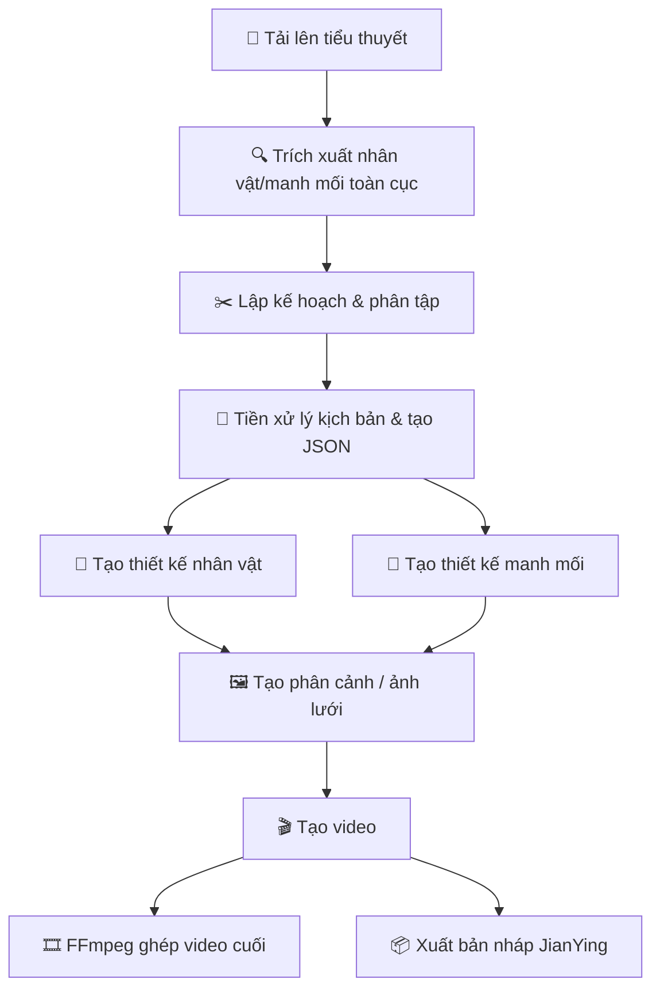
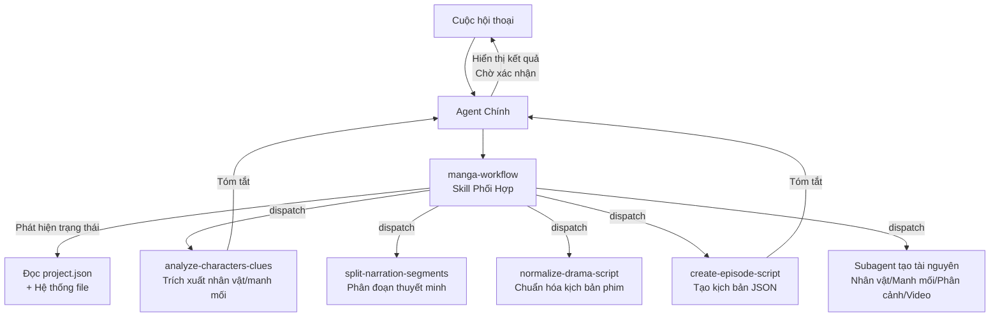

<h1 align="center">
  <br>
  <picture>
    <source media="(prefers-color-scheme: light)" srcset="frontend/public/android-chrome-maskable-512x512.png">
    <source media="(prefers-color-scheme: dark)" srcset="frontend/public/android-chrome-512x512.png">
    
  </picture>
  <br>
  ArcReel
  <br>
</h1>

<h4 align="center">Không gian làm việc tạo video AI mã nguồn mở — Từ tiểu thuyết đến video ngắn, hoàn toàn dẫn dắt bởi AI Agent</h4>

<p align="center">
  <a href="README.md"></a>
  <a href="README.en.md"></a>
  <a href="README.vi.md"></a>
</p>

<p align="center">
  <a href="#bắt-đầu-nhanh"></a>
  <a href="https://github.com/ArcReel/ArcReel/blob/main/LICENSE"></a>
  <a href="https://github.com/ArcReel/ArcReel"></a>
  <a href="https://github.com/ArcReel/ArcReel/pkgs/container/arcreel"></a>
  <a href="https://github.com/ArcReel/ArcReel/actions/workflows/test.yml"></a>
</p>

<p align="center">
  
  
  
  
  
  
  
  
</p>

<p align="center">
  
</p>

---

## Khả Năng Cốt Lõi

<table>
<tr>
<td width="20%" align="center">
<h3>🤖 Quy Trình AI Agent</h3>
Dựa trên <strong>Claude Agent SDK</strong>, phối hợp Skill + Subagent tập trung cho hợp tác đa agent, tự động hoàn thành toàn bộ chuỗi từ kịch bản đến tổng hợp video
</td>
<td width="20%" align="center">
<h3>🎨 Tạo Hình Ảnh Đa Nhà Cung Cấp</h3>
<strong>Gemini</strong>, <strong>Volcengine Ark</strong>, <strong>Grok</strong>, <strong>OpenAI</strong> và nhà cung cấp tùy chỉnh. Thiết kế nhân vật đảm bảo tính nhất quán; theo dõi manh mối duy trì sự liên tục của đạo cụ/bối cảnh
</td>
<td width="20%" align="center">
<h3>🎬 Tạo Video Đa Nhà Cung Cấp</h3>
<strong>Veo 3.1</strong>, <strong>Seedance</strong>, <strong>Grok</strong>, <strong>Sora 2</strong> và nhà cung cấp tùy chỉnh, chuyển đổi ở cấp toàn cục hoặc dự án
</td>
<td width="20%" align="center">
<h3>⚡ Hàng Đợi Bất Đồng Bộ</h3>
Giới hạn RPM + kênh đồng thời Image/Video độc lập, lập lịch lease-based, hỗ trợ tiếp tục từ điểm dừng
</td>
<td width="20%" align="center">
<h3>🖥️ Giao Diện Làm Việc</h3>
Web UI quản lý dự án, xem trước tài nguyên, khôi phục phiên bản, theo dõi tác vụ real-time SSE, tích hợp trợ lý AI
</td>
</tr>
</table>

## Quy Trình Làm Việc



## Bắt Đầu Nhanh

> ⚠️ **Hệ điều hành**: Linux / macOS / Windows WSL2 (Claude Agent SDK và một số phụ thuộc chỉ hỗ trợ POSIX; Windows gốc chưa được hỗ trợ — dùng Docker Desktop hoặc WSL2)

### Triển Khai Mặc Định (SQLite)

```bash
git clone https://github.com/ArcReel/ArcReel.git
cd ArcReel/deploy
cp .env.example .env
docker compose up -d
# Truy cập http://localhost:1241
```

### Triển Khai Production (PostgreSQL)

```bash
cd ArcReel/deploy/production
cp .env.example .env    # Đặt POSTGRES_PASSWORD
docker compose up -d
```

### Cài Đặt 1-Click

```bash
# macOS / Linux
curl -fsSL https://raw.githubusercontent.com/ArcReel/ArcReel/main/install.sh | bash

# Windows — chạy install.bat hoặc install.ps1
```

Sau lần khởi động đầu tiên, đăng nhập bằng tài khoản mặc định (tên đăng nhập `admin`, mật khẩu đặt qua `AUTH_PASSWORD` trong `.env`; nếu chưa đặt sẽ tự tạo và ghi lại). Vào **Cài đặt** (`/settings`) để hoàn tất cấu hình:

1. **ArcReel Agent** — Cấu hình Anthropic API Key (điều khiển trợ lý AI), hỗ trợ tùy chỉnh Base URL và mô hình
2. **Tạo hình ảnh/video AI** — Cấu hình ít nhất một API Key nhà cung cấp (Gemini / Volcengine Ark / Grok / OpenAI), hoặc thêm nhà cung cấp tùy chỉnh

> 📖 Chi tiết xem [Hướng dẫn bắt đầu](docs/vi/getting-started.md)

## Tính Năng Nổi Bật

- **Chuỗi sản xuất hoàn chỉnh** — Tiểu thuyết → Kịch bản → Thiết kế nhân vật → Phân cảnh → Video → Thành phẩm, phối hợp 1-click
- **Kiến trúc đa agent** — Skill phối hợp phát hiện trạng thái dự án và tự động điều phối Subagent tập trung
- **Hỗ trợ đa nhà cung cấp** — Hình ảnh/Video/Văn bản đều hỗ trợ Gemini, Volcengine Ark, Grok, và OpenAI
- **Nhà cung cấp tùy chỉnh** — Kết nối bất kỳ API tương thích OpenAI / Google (VD: Ollama, vLLM, proxy bên thứ ba)
- **Hai chế độ nội dung** — Chế độ thuyết minh (narration) chia theo nhịp đọc; Chế độ phim (drama) tổ chức theo cảnh/hội thoại
- **Kế hoạch phân tập tiến dần** — Hợp tác người-AI chia tiểu thuyết dài: thăm dò → Agent gợi ý điểm ngắt → người dùng xác nhận
- **Nhất quán nhân vật** — AI tạo thiết kế nhân vật trước; tất cả phân cảnh và video sau đều tham chiếu thiết kế này
- **Theo dõi manh mối** — Đạo cụ, yếu tố bối cảnh quan trọng giữ nhất quán qua các cảnh
- **Lịch sử phiên bản** — Mỗi lần tạo lại tự động lưu phiên bản, khôi phục 1-click
- **Theo dõi chi phí đa nhà cung cấp** — Chi phí hình ảnh/video/văn bản đều được theo dõi, tính phí theo chiến lược từng nhà cung cấp
- **Xuất bản nháp JianYing** — Xuất ZIP tương thích JianYing/CapCut theo tập ([Hướng dẫn](docs/vi/jianying-export-guide.md))
- **Chế độ lưới** — Ghép nhiều phân cảnh thành ảnh lưới (grid_4/grid_6/grid_9)
- **Quản lý nhiều API Key** — Mỗi nhà cung cấp hỗ trợ nhiều API Key, chuyển đổi active
- **Giao diện 3 ngôn ngữ** — Hỗ trợ Tiếng Việt 🇻🇳, English 🇺🇸, 中文 🇨🇳
- **Nhập/Xuất dự án** — Đóng gói toàn bộ dự án để sao lưu và di chuyển

## Kiến Trúc Trợ Lý AI

Trợ lý AI của ArcReel dựa trên Claude Agent SDK, sử dụng kiến trúc đa agent **Skill phối hợp + Subagent tập trung**:



**Nguyên tắc thiết kế cốt lõi**:

- **Skill phối hợp (manga-workflow)** — Phát hiện trạng thái dự án, tự động xác định giai đoạn hiện tại, dispatch Subagent tương ứng, hỗ trợ vào từ bất kỳ giai đoạn nào
- **Subagent tập trung** — Mỗi Subagent hoàn thành một tác vụ rồi trả về; văn bản tiểu thuyết lưu trong Subagent, Agent chính chỉ nhận tóm tắt
- **Ranh giới Skill vs Subagent** — Skill xử lý thực thi deterministic (gọi API, tạo file); Subagent xử lý tác vụ cần suy luận
- **Xác nhận giữa các giai đoạn** — Sau mỗi Subagent, Agent chính hiển thị tóm tắt và chờ người dùng xác nhận

## Công Nghệ Sử Dụng

| Tầng | Công nghệ |
|------|-----------|
| **Frontend** | React 19, TypeScript, Tailwind CSS 4, wouter, zustand, Framer Motion, Vite |
| **Backend** | FastAPI, Python 3.12+, uvicorn, Pydantic 2 |
| **AI Agent** | Claude Agent SDK (kiến trúc Skill + Subagent) |
| **Tạo hình ảnh** | Gemini, Volcengine Ark, Grok, OpenAI |
| **Tạo video** | Gemini Veo 3.1, Volcengine Seedance, Grok, OpenAI Sora 2 |
| **Xử lý đa phương tiện** | FFmpeg, Pillow |
| **ORM & CSDL** | SQLAlchemy 2.0 (async), Alembic — SQLite (mặc định) / PostgreSQL (production) |
| **Xác thực** | JWT, API Key (SHA-256), Argon2 password hashing |
| **Triển khai** | Docker, Docker Compose |

## Tài Liệu

- 📖 [Hướng dẫn bắt đầu](docs/vi/getting-started.md) — Hướng dẫn từ A-Z bằng tiếng Việt
- 📦 [Hướng dẫn xuất JianYing](docs/vi/jianying-export-guide.md) — Nhập video vào JianYing/CapCut để chỉnh sửa
- 📖 [Getting Started (English)](docs/getting-started.md)
- 📖 [完整入门教程 (中文)](docs/getting-started.md)

## Đóng Góp

Chào mừng đóng góp code, báo lỗi hoặc đề xuất tính năng!

### Phát Triển Local

```bash
# Yêu cầu: Python 3.12+, Node.js 20+, uv, pnpm, ffmpeg

# Cài dependencies
uv sync
cd frontend && pnpm install && cd ..

# Khởi tạo database
uv run alembic upgrade head

# Khởi động backend (Terminal 1)
uv run uvicorn server.app:app --reload --port 1241

# Khởi động frontend (Terminal 2)
cd frontend && pnpm dev

# Truy cập http://localhost:5173
```

### Chạy Tests

```bash
# Backend tests
python -m pytest

# Frontend kiểm tra kiểu + tests
cd frontend && pnpm check
```

## Giấy Phép

[AGPL-3.0](LICENSE)

---

<p align="center">
  Nếu thấy dự án hữu ích, hãy cho một ⭐ Star ủng hộ nhé!
</p>
